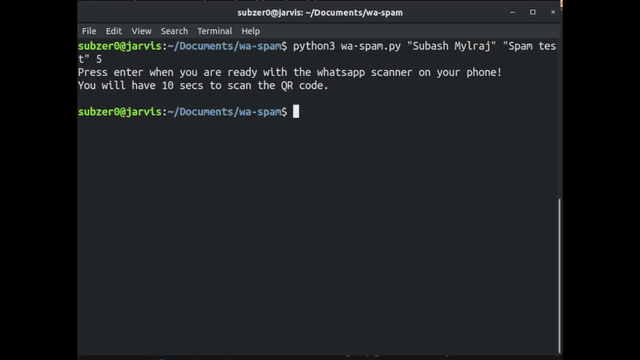

# whatsapp-spambot
A python script to spam a chat on whatsapp!

## Introduction
This script can send a finite amount of messages to a chat on whatsapp. It uses the splinter library to type and mouse-click. 

*DISCLAIMER:* The contents of this repository were written only for educational purposes and not to cause trouble or annoyance to any person or group of persons.
The author of this repository is not responsible for any nuisance caused. This repository is a mere attempt to automate sending messages on whatsapp. It showcases the capability of automation possible using the splinter library.

## Installation

This script uses the splinter package. Run:
```
chmod +x setup.sh
bash setup.sh
```
The setup file installs splinter, argparse and [geckodriver](https://github.com/mozilla/geckodriver). Geckodriver is a web browser engine used by mozilla firefox. We use it here to link our script and the browser.

## Working

The first argument is the name of the chat.<br>
The second argument is the message.<br>
The third argument is the number of times that the message needs to be sent.<br>
```
python3 hw.py "Subash Mylraj" "spam test!" 5
```



Use the following command to get more help.
```
python3 wa-spam.py -h

usage: wa-spam.py [-h] [-n] [--waittime WAITTIME] chat_name msg count

Spam your friends or enemies on whatsapp!

positional arguments:
  chat_name            Name of the chat you want to spam
  msg                  Message to be sent
  count                Number of messages to be sent

optional arguments:
  -h, --help           show this help message and exit
  -n                   Explicitly set the network proxy type to: no proxy
  --waittime WAITTIME  Change the time that the application waits for you to
                       login. Default: 10 seconds
```


